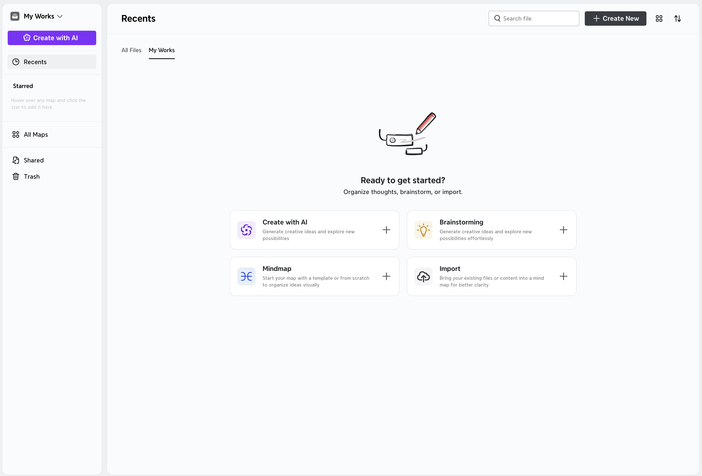
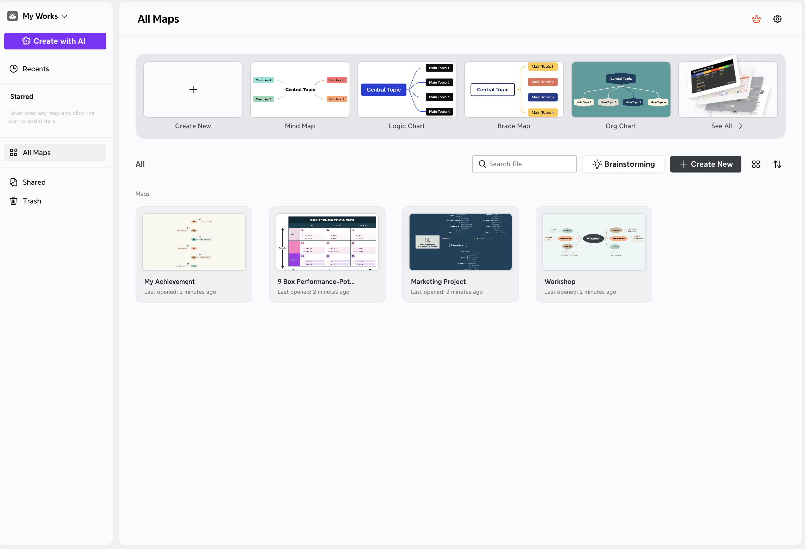
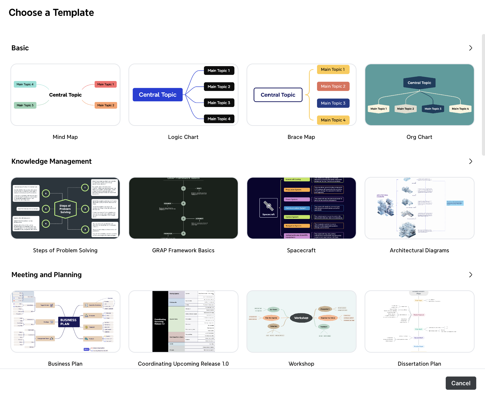
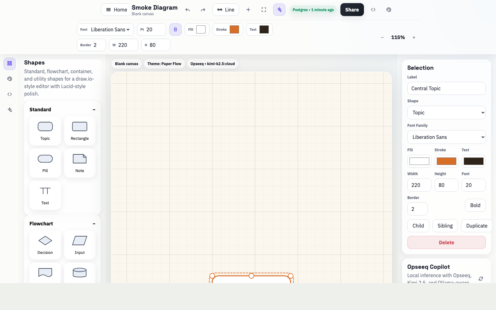
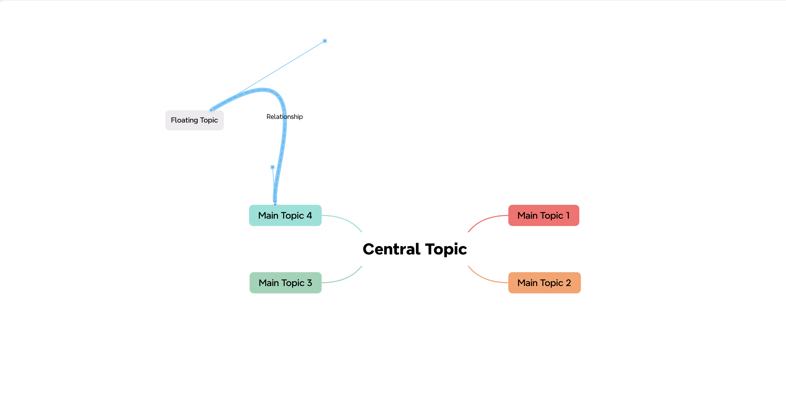
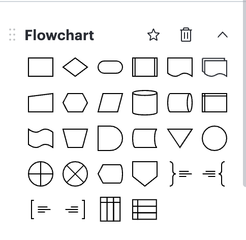
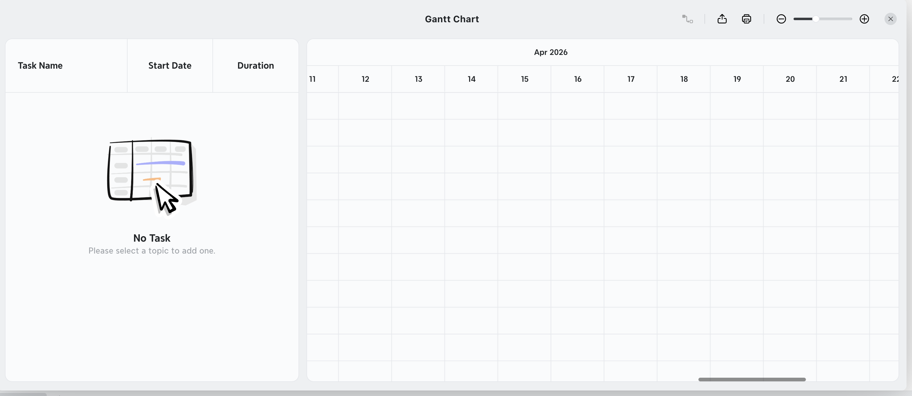
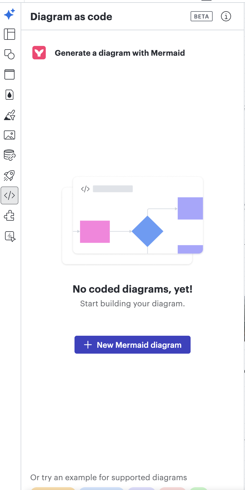
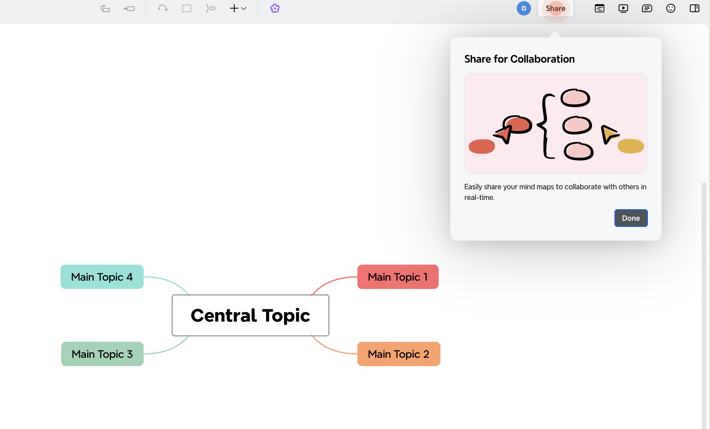

# Lucidity

Self-hosted workspace for visual thinking: mind maps, flowcharts, templates, Mermaid-to-diagram import, and a Lucid-style canvas editor. Data can be stored locally via PostgreSQL so diagrams persist between sessions.

## Technical summary

- **Frontend:** Single-page app served by a small Node HTTP server (`server.mjs`), with an SVG-based editor (shapes, connectors, themes, export).
- **Persistence:** Optional PostgreSQL for saved maps and document metadata; the UI reflects save/sync state in the header.
- **Scope:** Template gallery, stencil libraries (including flowchart symbols), Gantt-style scheduling view, and “diagram as code” flows for Mermaid.

## Screenshots

Home — recents, quick starts, and map library entry points.



All maps — browse maps and jump into templates (mind map, logic chart, org chart, and more).



Templates — choose a starting layout across basic, knowledge, planning, and other categories.



Editor — canvas with shape library, formatting, and properties for the selected element.



Mind map canvas — hierarchical topics, relationships, and free positioning on the grid.



Flowchart stencils — standard process/decision/data symbols for process diagrams.



Gantt — task name, start, duration, and a timeline grid for schedule-style views.



Mermaid / diagram-as-code — start from Mermaid to build an editable diagram.



Share — collaboration entry point from the diagram toolbar.



## Run locally

**Requirements:** Node.js 18+ and npm.

1. Install dependencies:

   ```bash
   npm install
   ```

2. Start PostgreSQL (bundled Compose file):

   ```bash
   npm run db:start
   ```

3. Start the app:

   ```bash
   npm start
   ```

4. Open **http://127.0.0.1:4173** in your browser.

The default database URL targets `127.0.0.1:5433` with user/password/database `lucidity`. Override with `DATABASE_URL` if you use another Postgres instance. Optional: set `PORT` or `HOST` to change the listen address.

End-to-end tests (Playwright):

```bash
npm run test:e2e
```

## Repository

https://github.com/DylanCkawalec/lucidity.git
